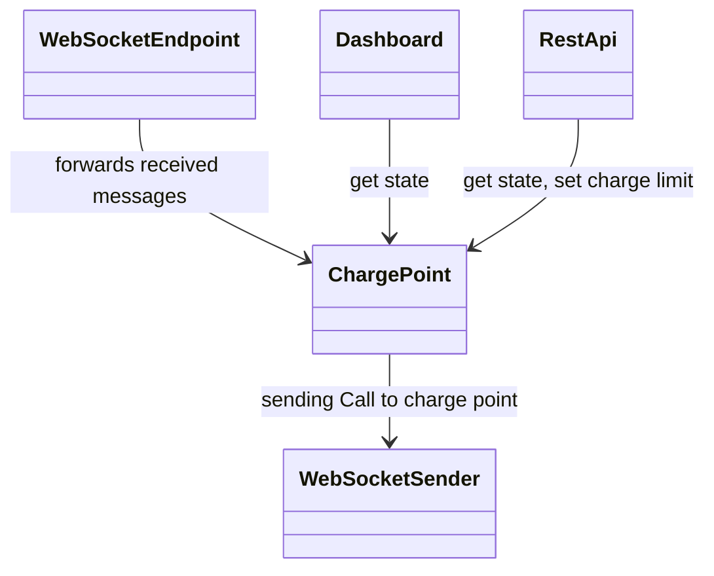
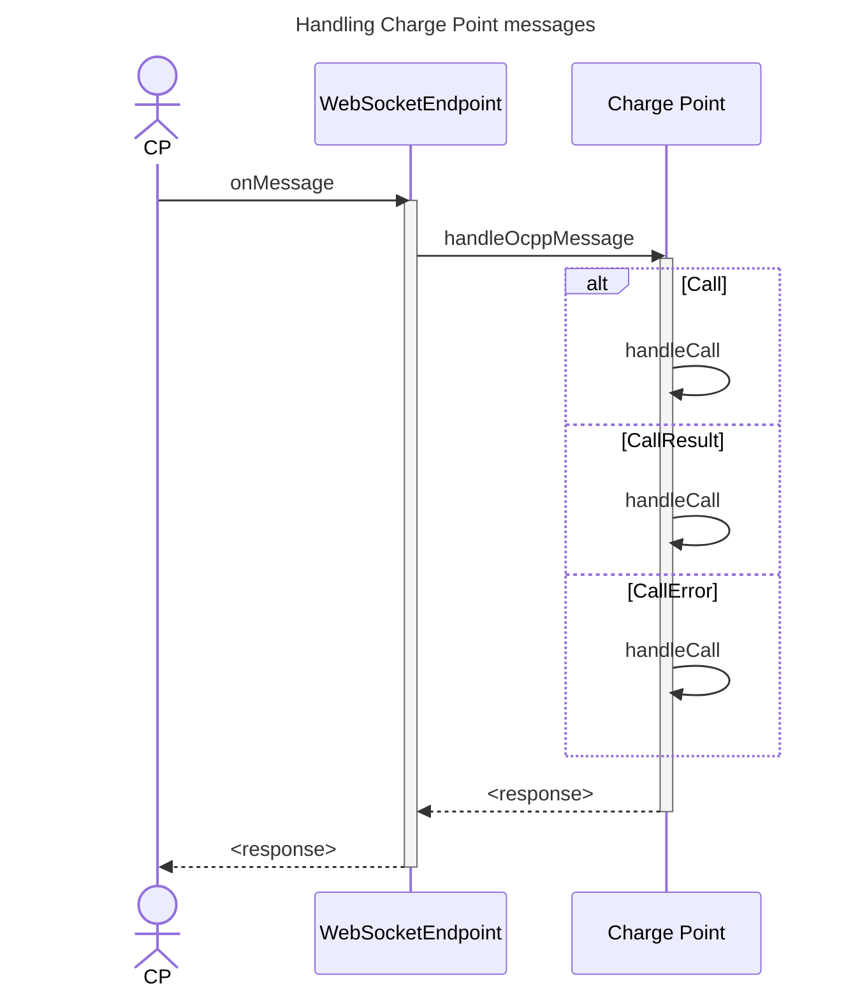
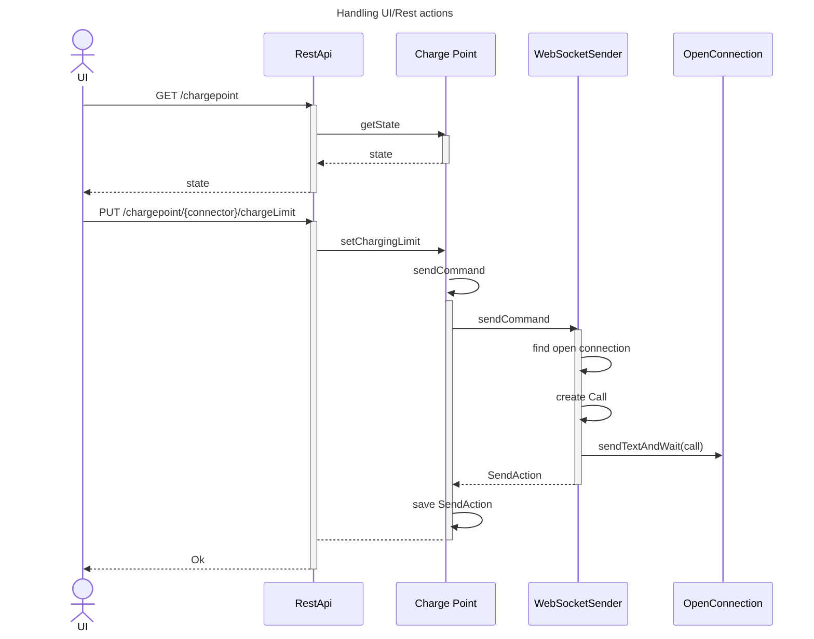
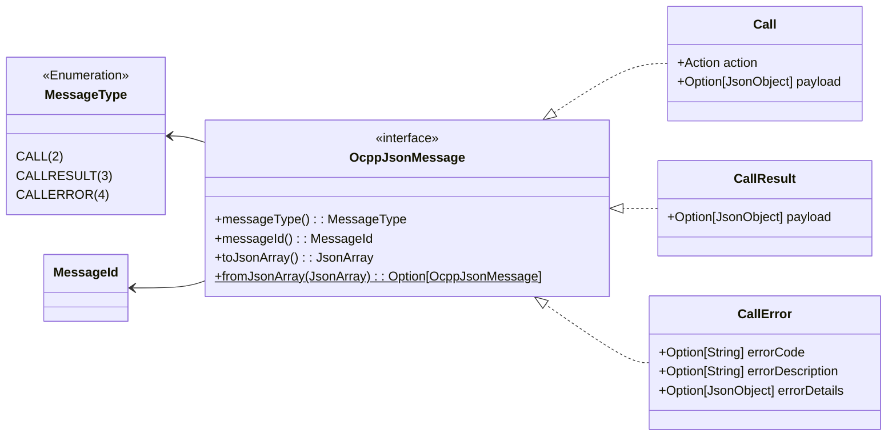

# Smart Charge Demo

This is a demo implementation of a CPO using OCPI 1.6 protocol.
It is intended as an example of how one can build there own CPO and smart charge solution for a home charger.

Requirements:
- The charger must support OCPI 1.6+
- You must be able to change the charger to point to this CPO implementation.

A simple dashboard is provided to display some state of the charger.
A simple rest api is available for external services to get the charge point state and to set a charge limit.

As an example, a Home Assistant configuration is added which can be used to control this CPO via Rest.

## Run the demo

To start the CPO, run:
```shell
sdk env
./mvn quarkus:dev
```

Open the dashboard on http://localhost:8080.

Open the [simulator/better_simulator.html](./simulator/better_simulator.html) in a browser.

Start Home Assistant
In `home-assistant` folder, run:
```sh
docker compose up [-d]
```

Open Home Assistant in the browser: http://localhost:8123 (user: demo, password: demo)

!!! note
    HA will show errors in the logs while no charge point is connected and no status notification for connector 1 has been received.

In the simulator, click
- Connect
- Fill in 'Tag1' as Tag and click 'Authorize'
- Set 'Connector uid' to '1' and click 'Status Notification'.

View the state of the connection to be changed because of these action, both in the UI and in Home Assistant.

Perform other functions as part of an OCPI flow. Read the OCPI 1.6 specification to learn more about this.

## CPO Implementation

The CPO is implemented using Java 22 and Quarkus.
It supports just a single charger.
All state is in memory.

### Basic design

The implementation is just around these basic classes.



|                   |                                                                                                     |
| ----------------- | --------------------------------------------------------------------------------------------------- |
| ChargePoint       | The main class keeping the state of the charge point and handling all supported operations          |
| WebSocketEndpoint | The WebSocket endpoint receiving the websocket connections and forwaring message to the ChargePoint |
| WebSocketSender   | Used by ChargePoint to send events to the charge point over websocket                               |
| DashBoard         | A Vaadin UI to display the state of the charge point                                                |
| RestApi           | A simple Rest API to get state and put a charge limit                                               |

### Handling Charge Point messages



### Handling UI/Rest actions



### OCPP-J Support

To support OCPP-J an `OcppJsonMessage` interface exists with implementations for each of the type: CALL, CALLRESULT and CALLERROR.

For deserialization, the `OcppJsonMessage.fromJsonArray` function returns an instance of the subtype.

Serialization is implemented by each subtype via the `toJsonArray()` function.



## Dashboard

A simple dashboard is created using Vaadin.
The dashboard is live updated with changes.

## Charge point simulator

The `simulator` folder contains some Charge point simulators to test the CPO.

`simulator_1.6.html` is a simple simulator. It does nothing by itself. You have to do all state changes manually!

`better_simulator.html` is a bit 'smarter'. It starts actions based on remote operations. It also supports more operations.

## Home Assistant

For a demo, the CPO can be controlled via Home Assistant. This demonstrates it is possible to control the CPO based on any data available in Home Assistant.

In a demo view, it is possible to see the state of the charge point.

Via a button and slider it is possible to set the charge limit. By setting it so a value > 0  a new transaction is started. By setting it so 0, the transaction is stopped.

A slider simulating the solar production can also be used to control the CPO.
As soon as the 'solar production' is >1500W (minumum of 6A) the charge limit is set.
When the solar production increases, the charge limit is also increased `eventually`.
When the solar production decreases, the charge limit is decreased immediately.

