# Build your own EV Smart Charge solution

<!--
Welcome.
Managing energy is becoming more important. In NL most of the grid is congested, both for consumption and production.
I assume it's the same in many other countries.
So, also for homes it becomes also important to manage your incoming and outgoing energy.
Today I want to share with you how you can control your own
charger so you can create your own smart charge solution
to meet your own energy demands.

Something I've been working on for over a year for a customer.

After a short introduction,
I will start with a demo
and then go into the details of the communication protocol with the charger and then I'll show how it can be implemented.
For this I use a Quarkus application with a Vaadin UI.

Wanted to do live coding. But too much. And nothing left to offer to the demo gods.
-->

---
layout: image-right
image: /images/dalle-java-knight.webp
---

# Introduction


Joost den Boer  

Senior Software Engineer 
(Java, Scala, DevOps)  

Java: 25+ years  
Freelance: 15 years

Electronics, IoT, Home automation

<span class="fixed bottom-15">
<mdi:web />https://diversit.eu<br/>
<carbon-logo-linkedin />https://www.linkedin.com/in/joostdenboer/<br/>
<carbon-logo-github />https://github.com/diversit<br/>
<carbon-email/> jdboer@diversit.eu
</span>

<!--
Briefly about me.

Contractor or freelancer : medieval term for mercenary warrior, who is sworn to no lord, a 'free' lance.

Background in Technical Computer Science.
At home doing a bit of electronics, lots of IoT stuff, last couple of year using Home Assistant.

Image generated by Dall-E 3 using a prompt from ChatGPT. (prompt: An illustration of a Java software developer depicted as a medieval knight on a white horse. The knight is wearing armor decorated with Java logos, holding a lance. The background shows a fantasy landscape with computer screens and castles, blending technology and medieval elements. One of the castles has the Devoxx logo on it.)
-->

---
layout: default
---

# Terminology

| | |
|-|-|
| EV | Electric Vehicle |
| Charge Point | A physical system where the electic vehicle can be charged |
| Connector | Electrical socket or cable on a Charge Point |
| EVSE | Electric Vehicle Supply System. The part of a Charge Point which provides energy to the EV |
| CPO | Charge Point Operator |
| OCPP | Open Charge Point Protocol |

<!--
EV: car, scooter, bike, truck.
Some termininology so we're all talking about the same things.
Note that an EVSE is NOT a charge point but a part of.

EVSE: some specs talk about EVSE, others about charge points.
-->

---
layout: image-right
image: /images/pixlr-drawing-ev-evse-cloud-transparant.png
backgroundSize: contain
---

# What is?

- Charging
- Smart

<div v-click v-click.hide class="text-center mt-10">It "behaves" to your personal preferences</div>

<div v-click v-click.hide class="fixed top-50">
For the customer:

- not exceeding the contract --> fines
  - take the actual usage into account
- still able to charge all vehicles
- spreading over a long period instead of all at once
- based on planning
- based on battery status of EV
</div>

<div v-click class="fixed top-50">
For you:

- energy contract
- calendar / planned trips
- solar production
- time of day
- use car as battery for your house (V2X)
- weather
- ... (endless posibilities)
</div>

<!--
A bit of background. What is a 'charge solution' and when is it smart? 

Charging: charging the battery of an electic vehicle

Smart: "it behaves to your personal preferences"
This is unique for everyone. Therefore I think this cannot be packaged and sold as a product.
Also, it is likely to use personal and location specific data which you might not want to share with a cloud service.

For customer: ... but not limited to
Realtime measureing of charge groups and building.

For you: whatever you want
V2X: still new! Requires newer protocol (2.1.1) so charge point can communicate with the car and allow energy to flow from the car to the house. Not supported by many charge points and cars. 

Image: Pixlr (prompt: A drawing of an electric vehicle connected to an electrical charge station. The EVSE is wirelessly connected to a service in the cloud. Data shown on a mobile device. No background.)
-->

---
layout: default
---

# How does it work?

<div class="slidev-layout place-content-center">
<div>
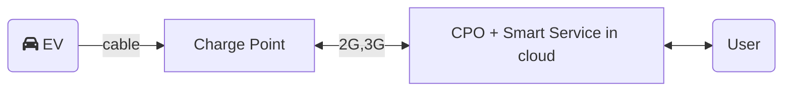
</div>
<br/>
<div v-click class="">
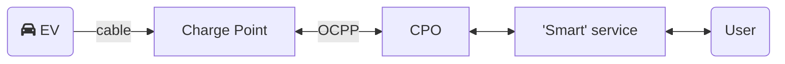
</div>

<br/>

<div v-click>

Requirements:
- OCPP compatible charge point (1.6+)
- Be able to change the charge point to use your own CPO
</div>
</div>

<!--
An EV connects to a Charge Point.
The Charge Point connects to a CPO using a 'protocol'.
Most home charge points will connect to a CPO in the cloud provided by some company (over 2G/3G).
The CPO 'manages' the charge point and tells it what to do.
The company provided an app on which you can see information about the charging.

Take over control by having the charger connect to your own CPO
implementation. Then have a 'smart service' to control the CPO.
OCPP the open protocol for controlling charge points.

Might be a challenge to find a charge point for at home which is OCPP compatible.
Suspect not all charge point are fully compatible and therefore they are not advertised as OCPP compatible. Only a subset needed for home charger.
Second: must be able to connect to charge point to be able to change the CPO endpoint to your own CPO implementation.
-->

---
layout: default
---

# More protocols

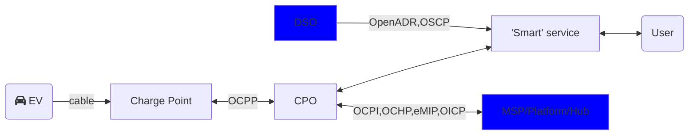
DSO : Distribution System Operator. The DSO manages the electricity grid.  
MSP : Mobility Service Provider.

- OCPI : Open Charge Point Interface (EVRoaming Foundation)
- OCHP : Open Clearing House Protocol (E-clearing)
- eMIP : eMobility Inter-Operation Protocol
- OICP : Open InterCharge Protocol
- OSCP : Open Smart Charging Protocol (Open Charge Alliance)
- OpenADR : Open Automated Demand Response (OpenADR Alliance)

<!--
There are many more protocol which we will not dive into today.

MSP : controlling access passes and billing.

Protocols available for DSO's to communicate back to the grid user about the available current.
In NL 7 DSO's spread over the country. Hard to find out what they're doing and which protocol they will support. Still very busy being able to measure the current status of the grid
before they can provide any info about it.
Current 'congestion' based on numbers on paper.

OCHP, eMSP, OICP: similar to OCPP

Nowadays platform providers like E-clearing with parties with many roles: CPO, MSP, Smart charge solution, Navigation service provider.
Do not believe in those Smart Charge solution services since 'smart' is too specific.
-->

---
layout: default
---

# Demo

<div class="slidev-layout place-content-center">
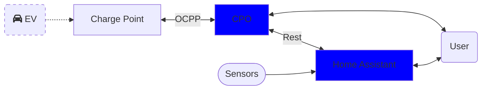
</div>

<!--
Start with a demo.
This is the setup.
- Home Assistant as the 'smart' service controlling the CPO
- Own CPO implementation for which I will show the code later.
- Using OCPP between CPO and charge point.
- Simulator as charge point.
- No EV.
-->

---
layout: fact
---

# DEMO

---
layout: two-cols-header
---

# OCPP Crash Course

Managed by Open Charge Alliance  
Since 2014
<br/><br/>
Versions: 1.6, <span class="line-through">2.0.1</span>, 2.1

Transport: SOAP or JSON (1.6+)

::left::

<div v-click>

- Charge point initiated operations
  - BootNotification
  - StatusNotification
  - Authorize
  - StartTransaction
  - StopTransaction
  - MeterValues
</div>

::right::

<div v-click>

- CPO initiated operations
  - RemoteStartTransaction
  - RemoteStopTransaction
  - SetChargingProfile
</div>

<!--
OCPP started in NL. Widely accepted. Managed by Open Charge Alliance.

v1.6 : most widely used.
v2.0.1 : not recommended
v2.1 : support V2X (vehicle to home,grid,..) and DER (direct energy routing, send energy to and from the car)

Since 1.6 JSON supported over WebSocket.

Minimal OCPP implementation to be informed of the state of the charge point and to control charging.
Operations either initiated by the Charge point or by the CPO.
In order of operation.

Read the full spec to get an overview of the whole specification and all operations.

Authorize optional? Based on 'AuthorizeRemoteTxRequests' setting whether it sends an Authorize before StartTransaction after a RemoteStartTransaction.
-->

---
layout: default
---

# OCPP-Json protocol

OCPP-J-1.6 specification

| | |
|-|-|
| Call | [2, "\<UniqueId>","\<Action>",{\<Payload>}] |
| CallResult | [3, "\<UniqueId>",{\<Payload>}] |
| CallError | [4, "\<UniqueId>", "\<errorCode>", "\<errorDescription>", {\<errorDetails>}] |

```
[2,
   "19223201",
   "BootNotification",
   {"chargePointVendor": "VendorX", 
   "chargePointModel": "SingleSocketCharger"}
]
```

<!--
Json protocol added since 1.6.
Data format a Json array.
3 data types: CALL, CALLRESULT, CALLERROR.

Unique id used to match results.

Note the CallResult/CallError have no action, so there is no way of knowning to which Call this is a result!
Therefore, when sending a Call, it must be saved so that it can be found by it's UniqueId
to know how to decode the payload.

Below an example of how the Call payload looks like.
-->

---
layout: full-center-header
# layout: default
---

# OCPP Boot workflow

::center::

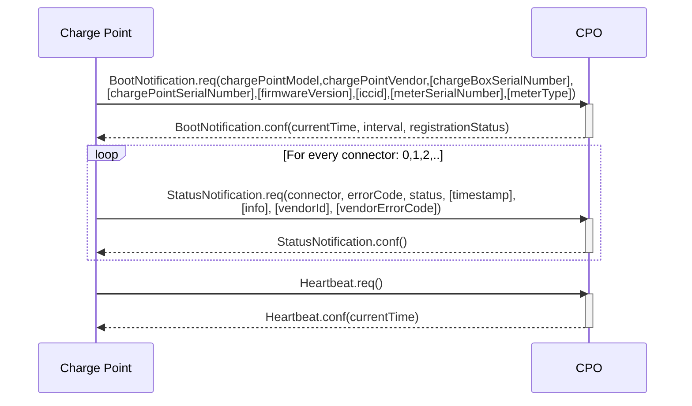

<!--
Charge point connects to a websocket and will then send Json data.
On connect, the charge point sends a BootNotification. 
The respons contains the current time, heart interval and registration status.

Followed by StatusNotifications for each connector, including 0 (overall status)

Charge point will send regular heartbeats to which CPO must respond with a current timestamp to which the charge point can set it's internal clock.
-->


---
layout: full
---

# OCPP Boot workflow Json payloads

```json
BootNotification.req
>{"chargePointVendor":"XYZ","chargePointModel":"EVC2.2","chargePointSerialNumber":"xxxxxxxx",
"chargeBoxSerialNumber":"xxxxxxxx","firmwareVersion":"4.3x.32R.16","iccid":"xxxxxxxxxxxxxxxxxxx",
"imsi":"xxxxxxxxxxxxxxx","meterType":"B23 112-10M","meterSerialNumber":"894001"}
BootNotification.conf
<{"status":"Accepted","currentTime":"2024-08-29T08:37:14.423Z","interval":30}

StatusNotification.req
>{"connectorId":0,"status":"Available","errorCode":"NoError","info":"","timestamp":"2024-10-03T11:37:37+00:00"}
StatusNotification.conf
<{}
StatusNotification.req
>{"connectorId":1,"status":"Pending","errorCode":"NoError","info":"..","timestamp":"2024-10-03T07:32:43+00:00"}
StatusNotification.conf
<{}
Heartbeat.req
>{}
Heartbeat.conf
>{"currentTime":"2024-10-03T12:46:00.047Z"}
```

<!--
How does this look like in Json.
Just the payload, not including the RPC data.

Status notification:
- Available : nothing connected
- Pending : connected
- SuspendedEV : EV stopped charging
- SuspendedEVSE : EVSE stopped charging (due to charging profile)

If nothing happens, heartbeats are always send regulary.

Extreemly useful to log or save all communication messages for debugging.
-->

---
layout: full-center-header
---

# OCPP Transaction workflow

::center::

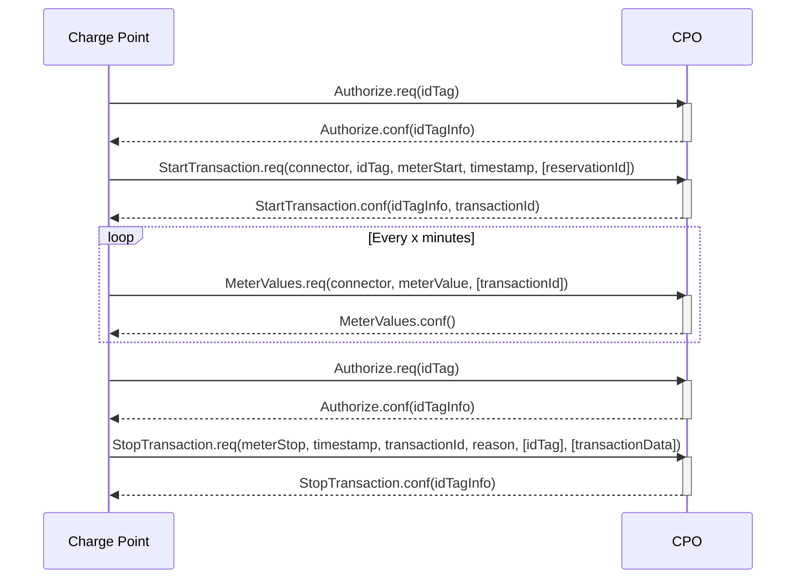

<!--
Authorize when tag is scanned. 
In response the idTagInfo contains the authorization status (Accepted, Blocked, Expired, Invalid)
Then, when accepted, the charge point will start a transaction.
The CPO cannot decline. When no response, the charge point will keep sending the StartTransaction.
During the transaction metervalues are emitted on configurable interval.
When tag scanned again, and accepted, then transaction stops.

Note: There are multiple settings which may alter this basic flow.

Note: it is NOT possible to deny the start of a transaction!
Stop can be refused!
-->

---
layout: full
class: pb-0
---
# OCPP Transaction workflow Json payloads

```json
Authorize.req
>{"idTag":"BABECAFE01"}
Authorize.conf
<{"idTagInfo":{"expiryDate":null,"parentIdTag":null,"status":"Accepted"}}
StartTransaction.req
>{"timestamp":"2024-10-03T07:07:15+00:00","connectorId":2,"meterStart":11450750,"idTag":"BABECAFE01"}
StartTransaction.conf
<{"idTagInfo":{"expiryDate":"2024-10-04T07:07:18.880Z","parentIdTag":null,"status":"Accepted"},
"transactionId":69}MeterValues.req
>{"connectorId":2,"transactionId":69,"meterValue":[{"timestamp":"2024-10-03T12:45:00+00:00",
"sampledValue":[{"measurand":"Energy.Active.Import.Register","unit":"Wh","value":"11492530"},
{"measurand":"Voltage","unit":"V","value":"235.2"},{"measurand":"Temperature","unit":"Celsius","value":"23"},
{"measurand":"Frequency","value":"50.03"},{"measurand":"Current.Import","phase":"L1","unit":"A",
"value":"15.90"},{"measurand":"Current.Import","phase":"L2","unit":"A","value":"15.90"},
{"measurand":"Current.Import","phase":"L3","unit":"A","value":"0.00"}]}]}
MeterValues.conf
<{}
StopTransaction.req
>{"transactionId":68,"idTag":"3DD8C84C","timestamp":"2024-10-02T11:27:26+00:00",
"meterStop":11450750,"reason":"Local"}
StopTransaction.conf
> {"idTagInfo":{"expiryDate":"2024-10-03T11:27:27.499Z","parentIdTag":null,"status":"Accepted"}}
```

<!--
Again the json payload.
The authorization may contain any string up to 20 chars.

Charge point sends tag again with start transaction.
Respond with a transaction id.

MeterValues contain the transaction id. Can contain many values. Depends on the charger brand. Can also be configured what to send.

Another authorize, same as before.
Stop transaction also contains transaction id and tag. May also contain data (see config).
CPO cannot prevent stopping. May send info about the tag on which the charger should update its cache.
Settings when/whether the charger should unlock.
-->

---
layout: full-center-header
---

# OCPP Remote Transaction workflow

::center::

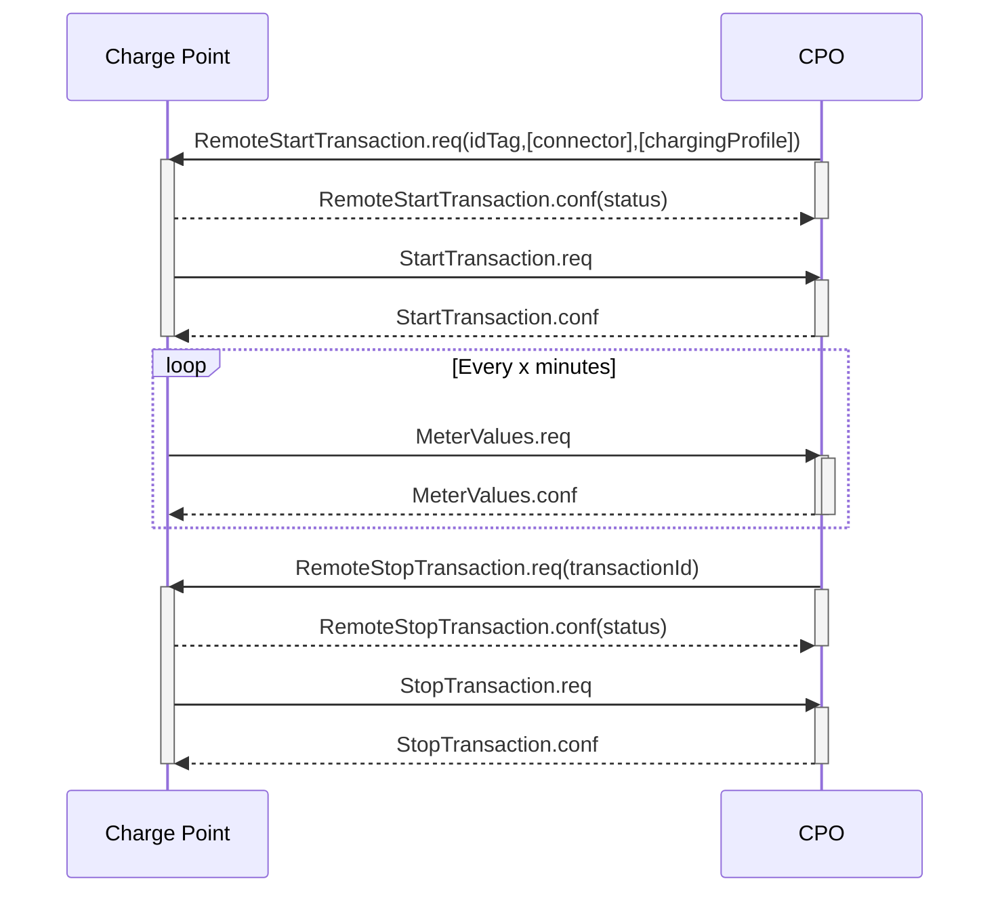

<!--
To start a transaction from the CPO.
Note that an EV must be connected to a connector -> status Pending.

Depending on the CP configuration, the CP might send an Authorize before the StartTransaction. This flow assumes it does not.
-->
---
layout: full
---

# OCPP Remote Transaction workflow Json

```json
RemoteStartTransaction.req
>{"connectorId":1,"idTag":"TEST","chargingProfile":{"chargingProfileId":2,"transactionId":null,
"stackLevel":10010,"chargingProfilePurpose":"TxProfile","chargingProfileKind":"Absolute",
"recurrencyKind":null,"validFrom":"2023-11-30T23:00:00.000Z","validTo":null,"chargingSchedule":
{"duration":null,"startSchedule":null,"chargingRateUnit":"A","chargingSchedulePeriod":[{"startPeriod":0,
"limit":16.0,"numberPhases":3}],"minChargingRate":6.0}}}
RemoteStartTransaction.conf
<{"status":"Accepted"}
StartTransaction.req: ..
StartTransaction.conf: ..
MeterValues.req: ..
MeterValues.conf: ..
RemoteStopTransaction.req
>{"transactionId":57}
RemoteStopTransaction.conf
 {"status":"Accepted"}
StopTransaction.req: ..
StopTransaction.conf: ..
```

<!--
Similar to previous flow.
Only the RemoteStart/Stop operations different.
-->

---
layout: full-center-header
---

# OCPP Control Charging

::center::

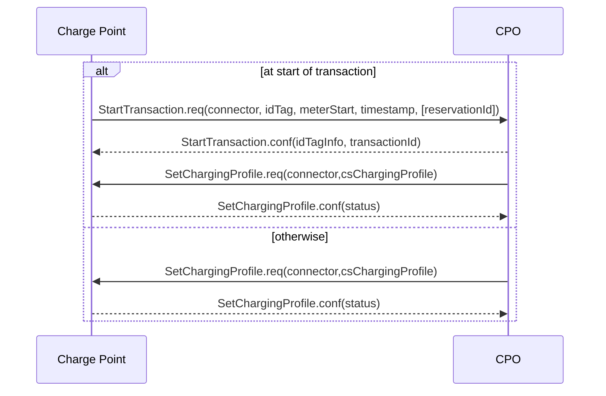

<!--
Ok, so then there is a transaction active and the EV is being charged. So how to control that: SetChargingProfile.

Can already be included in the RemoteStartTransaction operation.
Send during transaction to update charging preferences.

Control charging by sending a SetChargingProfile command with a charging profile.
3 tiers of profiles: Max, Default, Tx
Profile are stacked. Charger calculates the result.

No way to get the charging profiles set in the charger.
Only to reset or get calculated result.
-->

---
layout: two-cols-header
---

# OCPP Control Charging

::left::

```json
{
    "connectorId": 2,
    "csChargingProfiles": {
        "chargingProfileId": 2,
        "transactionId": 69,
        "stackLevel": 10010,
        "chargingProfilePurpose": "TxProfile",
        "chargingProfileKind": "Absolute",
        "recurrencyKind": null,
        "validFrom": "2023-11-30T23:00:00.000Z",
        "validTo": null,
        "chargingSchedule": {
            "duration": null,
            "startSchedule": null,
            "chargingRateUnit": "A",
            "chargingSchedulePeriod": [{
                "startPeriod": 0, "limit": 16, "numberPhases": 3
            }],
            "minChargingRate": 6
        }
    }
}
```

::right::

```json
 {"status":"Accepted"}
```

<!--
Many options to put in the charging profile.
Can stack them together.
Set stacklevel high enough to be activated.
Can preconfigure with profiles for time of day, day of week, etc.
Recurring, valid from-to
Duration of the schedule, multiple periods, etc.

This example sets the current profile directly to 16A limit on 3 phases for given transaction.

Charger should respond with Accepted, but if not then maybe should take action.
-->

---
layout: default
---

# OCPP Other Charge Point initiated operations

- Charge point initiated operations
  - DataTransfer
  - Diagnostics Status Notification
  - Firmware Status Notification

<!--
These are all async events send after the CPO started the operation.
-->

---
layout: two-cols-header
---

# OCPP Other CPO initiated operations

::left::

- CPO initiated operations
  - Cancel Reservation
  - Change Availability
  - Change Configuration
  - Clear Cache
  - Clear Charging Profile
  - Data Transfer
  - Get Composite Schedule
  - Get Configuration
  - Get Diagnostics
  - Get Local List Version
  - Reserve Now

::right::

  - Reset
  - Send Local List
  - Trigger Message
    - BootNotification
    - StatusNotification
    - DiagnosticsStatusNotification
    - FirmwareStatusNotification
    - Heartbeat
    - MeterValues
  - Unlock Connector
  - Update Firmware

<!--
Many more operations which can be triggered from the CPO.
Getting and Setting the configuration might be useful.
Not used in the demo.

Via TriggerMessage, the Charge Point can be requested to send some of it's messages.
- Clear charging profile : reset stacked profiles
- Get composite schedule : get calculated result
-->

---
layout: full-center-header
---

# CPO Implementation

::center::

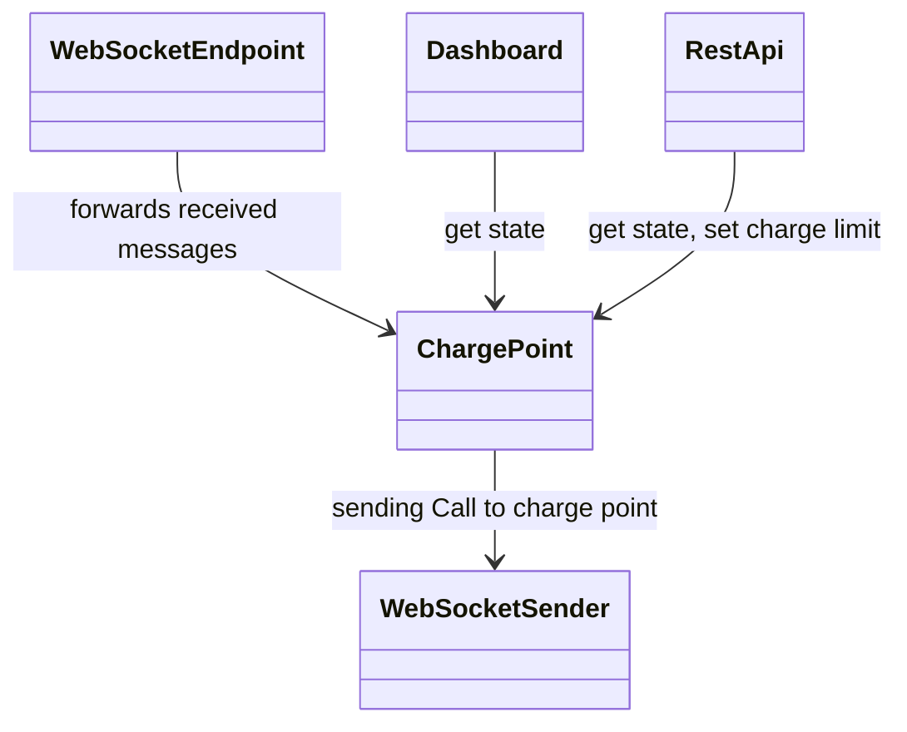

<!--
Now let's get to the demo CPO implementation.

A quick introduction into the design.
Simple implementation.
All synchronous.
Around a single ChargePoint instance which keeps some state of the charge point (in memory): connector states, transactions, charge box id.
-->


---
layout: two-cols-header
---

# CPO Implementation

::left::

<div>
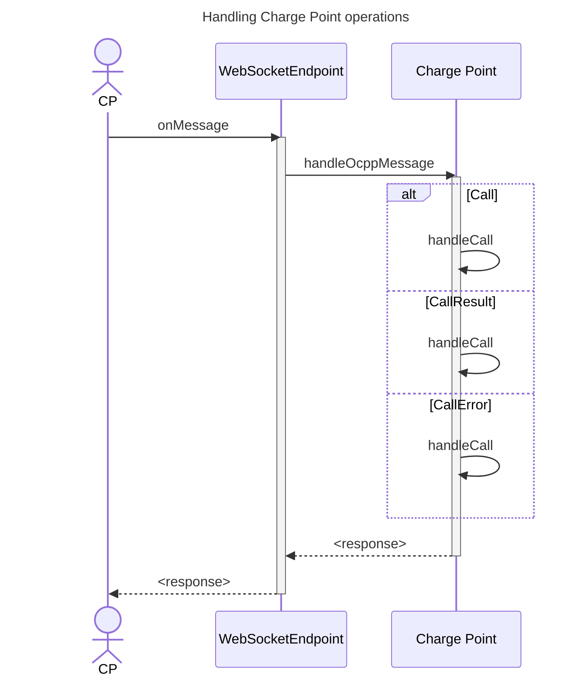
</div>

::right::

<div v-click>
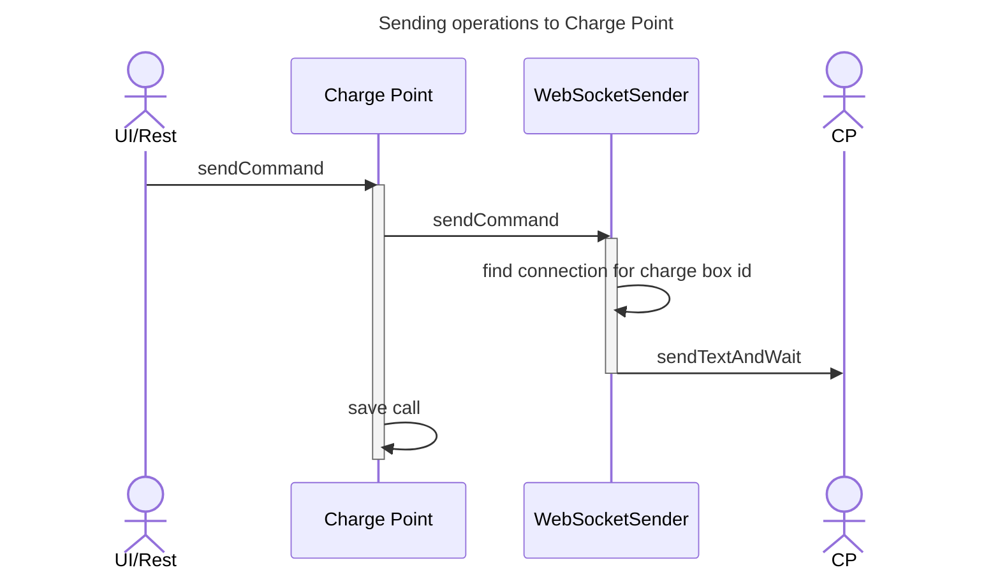
</div>

<!--
2 main flows in the application.
- Handling operations from the charge point.
  Depending on the received message type, the charge point handles a Call, CallResult or CallError.
- Sending actions to the charge point.
  WebSocketSender lookup of the websocket connection for given charge box id and sends the command.
-->

---
layout: default
---

# CPO Json protocol implementation

OCPP-J-1.6 specification

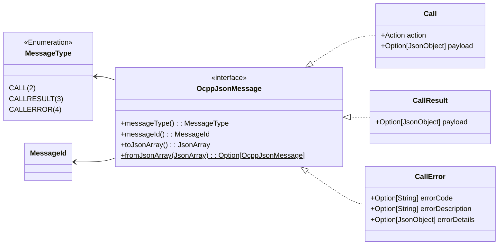

<!--
Sealed interface of OcppJsonMessage with 3 implementation records.
Deserialization via `fromJsonArray` function on interface.
Serialization via 'toJsonArray` implementation in records.
-->

---
layout: fact
---

# Code

---
layout: image-org
image: /images/quarkus-starter.png
---

<!--
Create Quarkus starter project with extensions.
-->

---
layout: section
---

# Thank you

<div class="flex justify-center items-center">
  
</div>

demo + slides<br/>
https://github.com/diversit/smart-charge-demo


---
layout: default
---


<carbon-logo-youtube/>@Technithusiast
https://www.youtube.com/@technithusiast

<!--
Using ChatGTP to control a device
based on some sensor inputs and a simple prompt.
-->

---
layout: default
---


<carbon-logo-youtube/> https://youtu.be/UuAXKQiPZPs?si=w2K_phFnKPNXTgpe

<!--
Interesting talk about outsmarting the grid.
This you can do yourself now.
-->